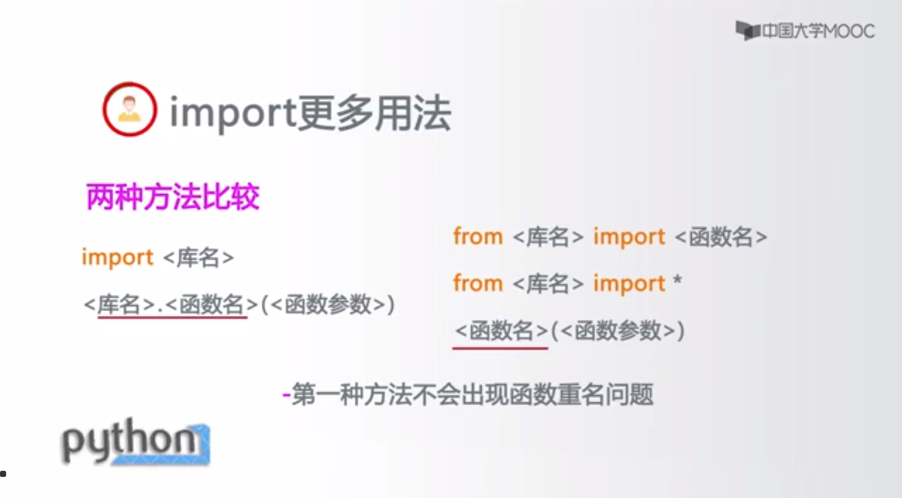
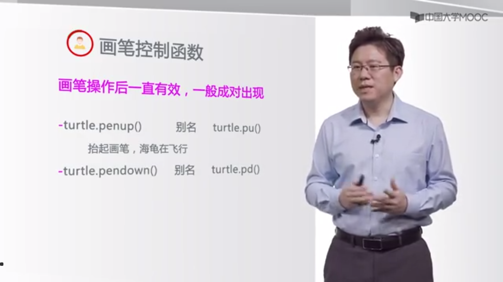
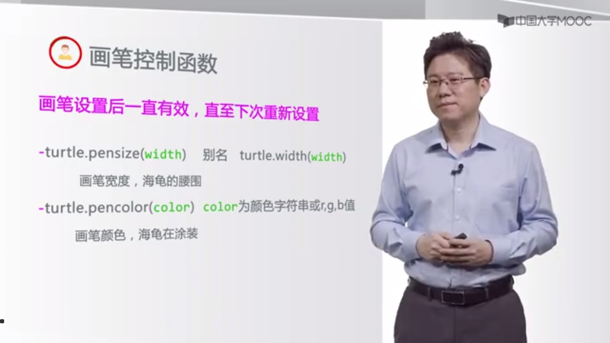
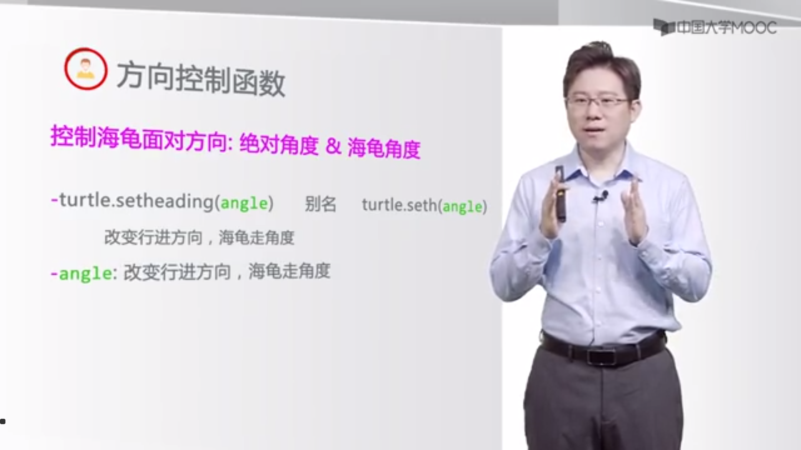
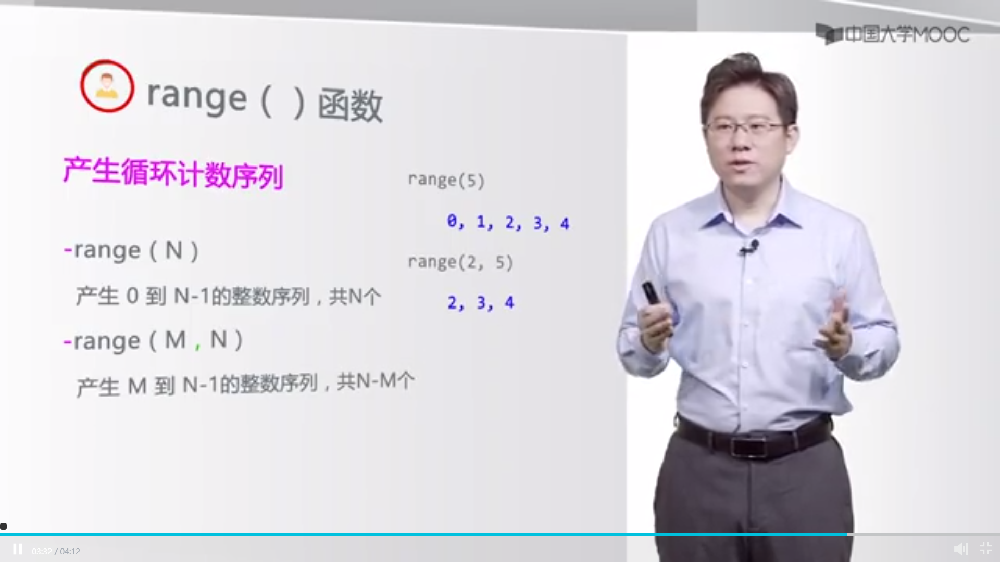

绝对坐标系：海龟在中心  
turtle.goto(x,y):运动到某一点  
海归坐标系：以海龟为视角  
turtle.bk 向后  
turtle.fd 向前  
turtle.circle 画圈  
绝对角度  
turtle.seth(angle)  
turtle.left(angle)  
turtle.right(angle)  
|英语|中文|
|---|---|
|white|白色|
|yellow|黄色
|magenta|平红|
|cyan|青色|
|blue|蓝色|
|black|黑色|
|seashell|海贝色|
|gold|金色|
|pink|粉红色|
|brown|棕色|
|purple|紫色|
|tomato|番茄色|
turtle.colorode(mode)  
1.0:rgp小数
2.0:rgb整数  

  

